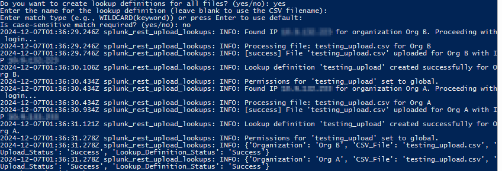
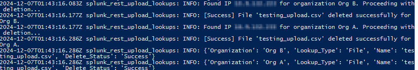
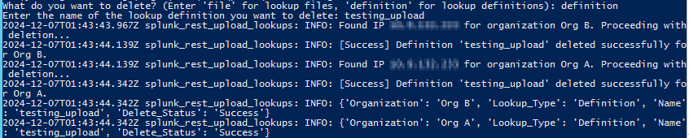

# Splunk Lookup Handler Scripts

## Overview

This repository contains two Python scripts that automate interactions with Splunk to manage lookup files and definitions across multiple Splunk instances.

- **`splunk_rest_handler_upload_lookups.py`**: Uploads lookup files to Splunk and optionally creates lookup definitions.
- **`splunk_rest_handler_delete_lookups.py`**: Deletes lookup files or lookup definitions from Splunk.

### Upload and Define Lookups



### Delete Lookup CSV Files



### Delete Lookup Definitions




## References

```
https://docs.splunk.com/Documentation/Splunk/9.3.2/RESTREF/RESTknowledge
https://community.splunk.com/t5/Splunk-Dev/Modifying-ACL-Saved-Search-permissions-through-REST-API-using/td-p/132794
https://github.com/mthcht/lookup-editor_scripts
https://github.com/beckyburwell/splunk_rest_upload_lookups/blob/main/splunk_rest_upload_lookups.py
```
