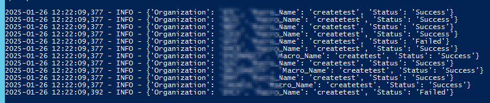

# Splunk Macro Creation Script

## Overview

Python script that automate interactions with Splunk to create macros across multiple Splunk instances. Also sets the permissions to global.

## Sample Output Screenshot

